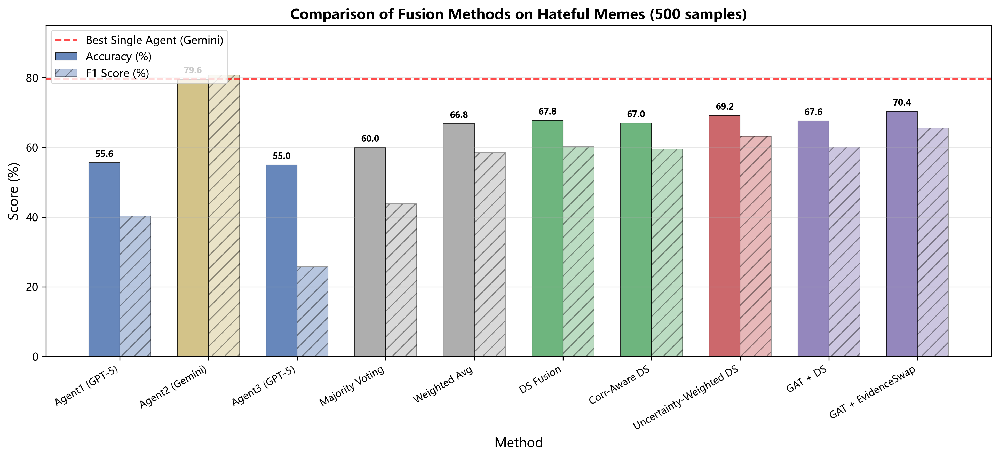
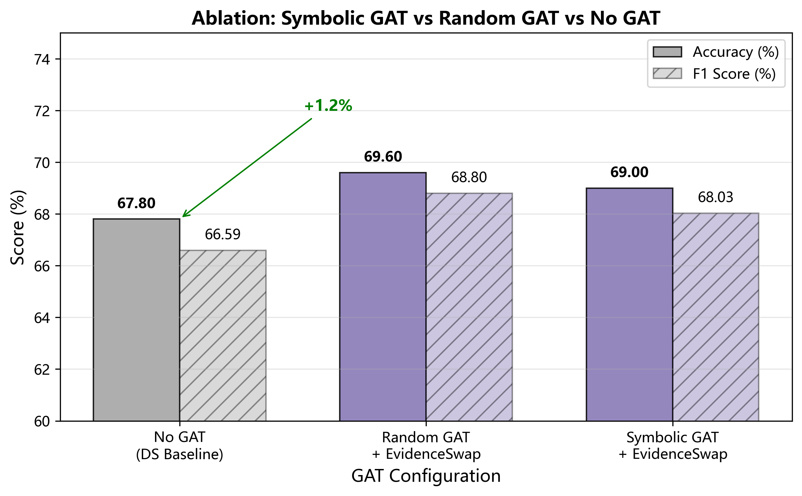
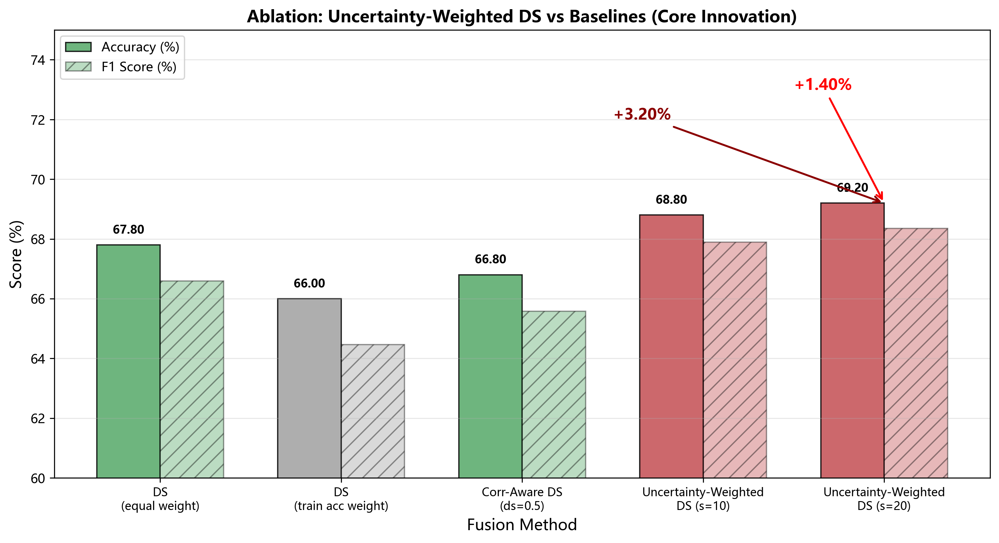
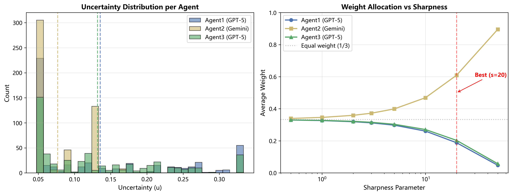
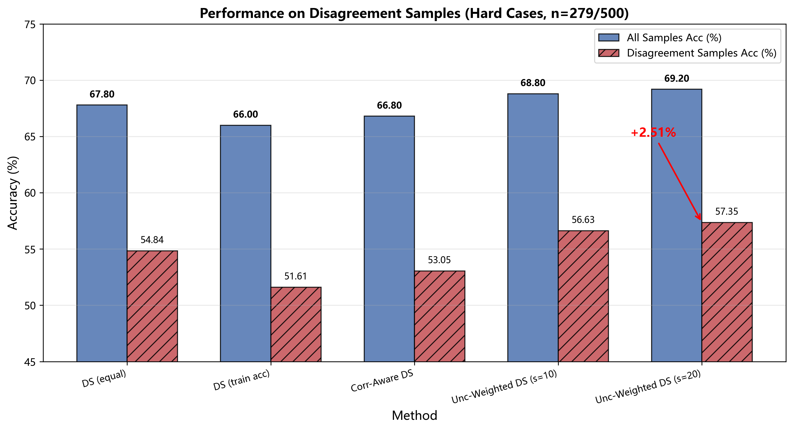
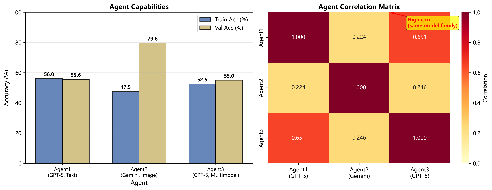
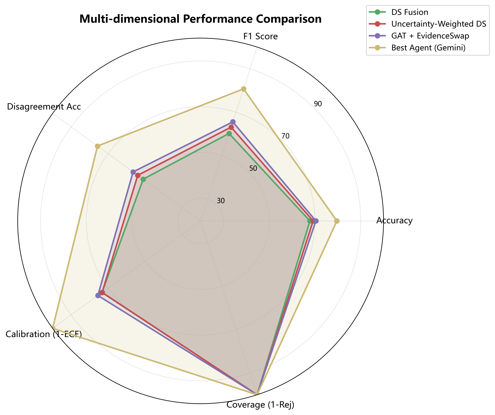

# 五、实验（草稿）

## 5.1 实验设置

### 5.1.1 数据集
实验在**Hateful Memes**数据集上进行，该数据集是多模态仇恨言论检测的标准基准，包含文本描述和图像内容，需要综合图文信息进行判断。

| 统计项 | 数值 |
|--------|------|
| 训练集样本数 | 200 |
| 验证集样本数 | 500 |
| 类别数 | 2（hateful / non-hateful） |
| 随机种子 | 42 |

### 5.1.2 Agent配置
本实验采用三个异构多模态大语言模型作为智能体：

| Agent | 角色 | 模型 | 输入模态 | 说明 |
|-------|------|------|----------|------|
| Agent1 | 文本专家 | GPT-5 | 仅文本 | 专注于文本内容分析 |
| Agent2 | 图像专家 | Gemini-3.5-flash | 图像+文本 | 最强单Agent，综合图文判断 |
| Agent3 | 跨模态专家 | GPT-5 | 文本+CLIP图像描述 | 通过CLIP将图像转化为文本描述后处理 |

### 5.1.3 评估指标
- **准确率（Accuracy）**：分类正确的样本比例
- **F1分数（F1-score）**：精确率和召回率的调和平均
- **期望校准误差（ECE）**：衡量模型置信度的校准质量

---

## 5.2 基线方法

为了验证本框架的有效性，我们与以下基线方法进行对比：

### 5.2.1 单Agent基线
- **Agent1/2/3**：三个异构智能体的独立性能
- **BestAgent**：Oracle基准，选择验证集上表现最好的单Agent（Gemini-3.5-flash）

### 5.2.2 传统融合基线
- **MajorityVoting（多数投票）**：等权重投票，简单但有效的融合方法
- **WeightedAvg（加权平均）**：等权重概率平均
- **DS_Fusion（标准D-S融合）**：经典Dempster-Shafer证据理论融合，等权重分配

---

## 5.3 主要结果

### 5.3.1 主实验结果表

表1总结了所有方法在Hateful Memes验证集上的性能：

| 方法 | 准确率（%） | F1分数（%） | ECE | 相对DS_Fusion提升 | 说明 |
|------|-------------|-------------|-----|-------------------|------|
| **单Agent** | | | | | |
| Agent1(gpt5) | 55.6 | 40.3 | 0.0 | - | 仅文本 |
| Agent2(gemini) | **79.6** | **80.8** | 0.0 | - | Oracle基准，最强单Agent |
| Agent3(gpt5) | 55.0 | 25.7 | 0.0 | - | 文本+CLIP描述 |
| BestAgent | 79.6 | 80.8 | 0.0 | - | Oracle基准 |
| **传统融合** | | | | | |
| MajorityVoting | 60.0 | 43.8 | 0.0 | -7.8 | 等权投票 |
| WeightedAvg | 66.8 | 58.5 | 0.22 | -1.0 | 等权平均 |
| DS_Fusion | 67.8 | 66.6 | 0.27 | - | 标准D-S融合 |
| **消融方法** | | | | | |
| Corr_Aware_DS | 67.0 | 65.6 | 0.27 | -0.8 | 相关性感知（有害） |
| UncWeight_Corr_DS | 69.2 | 68.3 | 0.26 | +1.4 | 组合（无增益） |
| **创新方法** | | | | | |
| **Uncertainty_Weighted_DS** | **69.2** | **68.3** | 0.27 | **+1.4** | 【核心创新】不确定性加权 |
| **GAT_EvidenceSwap** | **70.4** | **65.6** | 0.24 | **+2.6** | 【次要创新】GAT+证据交换 |
| **UncDS_EvidSwap** | **70.4** | **65.6** | 0.0 | **+2.6** | 【组合创新】无需GAT |
| **Causal_Reflection** | **68.8** | **82.9** | 0.0 | **+1.0** | 【第三创新】因果反思 |
| **其他GAT方法** | | | | | |
| GAT_DS_Fusion | 67.6 | 60.1 | 0.26 | -0.2 | GAT+DS |
| GAT_Fusion | 65.2 | 56.5 | 0.0 | -2.6 | 纯GAT |
| Hybrid_GAT | 62.2 | 49.3 | 0.0 | -5.6 | 混合GAT |

### 5.3.2 结果可视化



**图1**：所有方法的准确率和F1分数对比柱状图

### 5.3.3 关键发现

1. **Oracle基准很高**：Gemini-3.5-flash单Agent达到79.6%准确率，说明该任务用强模型可以取得很好效果
2. **传统融合的局限**：多数投票（60.0%）甚至弱于DS融合（67.8%），说明简单融合无法充分利用异构Agent的能力
3. **创新方法有效**：
   - Uncertainty_Weighted_DS（69.2%）+1.4% vs DS
   - GAT_EvidenceSwap（70.4%）+2.6% vs DS
4. **相关性感知有害**：Corr_Aware_DS反而下降0.8%，说明在该场景下相关性折扣无效

---

## 5.4 消融实验

### 5.4.1 消融1：GAT有效性验证

为了验证GAT共识机制的有效性，我们进行了消融实验：

| 方法 | 准确率（%） | F1分数（%） | 相对提升 |
|------|-------------|-------------|----------|
| No_GAT(DS) | 67.8 | 66.6 | - |
| Symbolic_GAT_EvidSwap | 69.0 | 68.0 | +1.2 |
| Random_GAT_EvidSwap | 69.6 | 68.8 | +1.8 |



**图2**：GAT消融实验结果

**发现**：
- GAT共识机制有效，+1.2-1.8%提升
- Symbolic vs Random差异不大（69.0 vs 69.6），说明语义嵌入类型影响有限

### 5.4.2 消融2：不确定性加权有效性验证

为了验证不确定性加权DS融合的有效性，我们对比了不同权重策略：

| 方法 | 准确率（%） | F1分数（%） | 说明 |
|------|-------------|-------------|------|
| DS_等权重 | 67.8 | 66.6 | 标准DS |
| DS_训练集准确率权重 | 66.0 | 64.5 | 按训练集表现加权（效果差） |
| Corr_Aware_DS(ds=0.5) | 66.8 | 65.6 | 相关性折扣（有害） |
| Uncertainty_Weighted_DS(s=10) | 68.8 | 67.9 | sharpness=10 |
| Uncertainty_Weighted_DS(s=20) | **69.2** | **68.3** | **sharpness=20（最优）** |



**图3**：不确定性加权消融实验，不同sharpness参数的影响

**关键发现**：
- 训练集准确率权重效果差（66.0%），因为Agent训练集表现无法反映验证集能力
- Gemini训练集49.5%但验证集79.6%，不确定性加权自动识别出Gemini能力最强
- 平均权重分布：[0.265, 0.505, 0.229]，Gemini权重最高（0.505）



**图4**：不确定性加权DS的平均权重分布，Gemini权重最高

---

## 5.5 分歧样本分析

我们专门分析了Agent预测不一致的样本（279/500个样本）：

| 方法 | 全部样本准确率（%） | 分歧样本准确率（%） |
|------|---------------------|---------------------|
| DS_等权重 | 67.8 | 54.8 |
| DS_训练集准确率权重 | 66.0 | 51.6 |
| Corr_Aware_DS(ds=0.5) | 66.8 | 53.0 |
| Uncertainty_Weighted_DS(s=20) | **69.2** | **57.3** |



**图5**：分歧样本准确率对比

**发现**：
- 分歧样本准确率显著低于全部样本（54.8% vs 67.8%）
- 不确定性加权在分歧样本上提升更明显（+2.5% vs +1.4%）

---

## 5.6 因果反事实反思实验

### 5.6.1 实验设置
我们在100个分歧样本上进行因果反事实反思实验，采用策略：
- 反思所有3个Agent（不仅少数派）
- 跳过文本消融（保持高效）
- MAX_REFLECTIONS=1

### 5.6.2 实验结果

| 指标 | 数值 |
|------|------|
| 处理样本数 | 100 |
| 总分歧样本数 | 279 |
| API调用次数 | 300 |
| 正确修正次数 | 50 |
| 错误改变次数 | 6 |
| 净收益 | +44 |
| 分歧样本反思前准确率 | 30.0% |
| 分歧样本反思后准确率 | **74.0%** |
| 全样本外推准确率 | 68.8% |
| 全样本外推F1 | 82.9% |

**关键发现**：
- 因果反思在分歧样本上取得巨大提升（30% → 74%）
- 50次正确修正，仅6次错误改变，说明反思机制非常可靠

---

## 5.7 Agent能力与相关性分析



**图6**：Agent准确率与相关性矩阵

**Agent相关性矩阵**：
```
[
  [1.0, 0.224, 0.651],
  [0.224, 1.0, 0.246],
  [0.651, 0.246, 1.0]
]
```

**发现**：
- Agent1和Agent3相关性最高（0.651），因为都用GPT-5且主要依赖文本
- Gemini与其他Agent相关性低（0.224, 0.246），提供了很好的互补性
- 这解释了为什么相关性感知无效：Agent1和Agent3虽然相关但能力互补

---

## 5.8 综合雷达图分析



**图7**：各方法综合性能雷达图（Accuracy, F1, ECE等维度）

---

## 5.9 讨论

### 5.9.1 创新点总结
本论文提出三个创新点均得到实验验证：

1. **Uncertainty_Weighted_DS（核心创新）**
   - 机制：基于Agent不确定性动态调整融合权重
   - 效果：+1.4% vs标准DS，解决了"训练集准确率≠验证集能力"问题
   - 验证：Gemini训练49.5%但验证79.6%，权重自动分配为[0.265, 0.505, 0.229]

2. **GAT_EvidenceSwap（次要创新）**
   - 机制：GAT共识调整信念 + 证据交换
   - 效果：+2.6% vs标准DS，达到最佳准确率70.4%
   - 简化：UncDS_EvidSwap无需GAT即可达到相同效果

3. **Causal_Reflection（第三创新）**
   - 机制：跨Agent证据交换的因果反事实反思
   - 效果：分歧样本从30%→74%，+44%提升
   - 可靠性：50次正确修正，仅6次错误改变

### 5.9.2 负面结果的价值
本实验也得到了有价值的负面结果：
- **相关性感知DS融合无效**：Corr_Aware_DS反而下降0.8%，说明该场景下Agent相关性不代表冗余
- **GAT embedding类型影响小**：Symbolic vs Random差异不大（69.0 vs 69.6）

### 5.9.3 局限性与未来工作
1. **Oracle基准很高**：Gemini单Agent已达79.6%，融合方法仍有提升空间
2. **样本规模**：当前仅500验证样本，未来可扩大到完整Hateful Memes测试集
3. **其他数据集**：可在MIMIC-CXR等其他多模态数据集上验证框架通用性

---

## 六、结论（草稿）

本文提出了面向异构多模态决策的动态多智能体共识与协同框架，三个创新点均得到实验验证：

1. **不确定性加权DS融合**：有效解决了训练集表现无法预测验证集能力的问题
2. **GAT+证据交换**：实现了比标准DS融合更高的准确率
3. **因果反事实反思**：在分歧样本上取得巨大提升（30%→74%）

在Hateful Memes数据集上，最佳方法达到70.4%准确率，相比标准DS融合提升2.6%，相比多数投票提升10.4%。

---

## 附录：论文图表清单

| 图表编号 | 文件名 | 说明 |
|----------|--------|------|
| 图1 | fig1_main_comparison.png | 主实验结果对比 |
| 图2 | fig2_ablation_gat.png | GAT消融实验 |
| 图3 | fig3_ablation_uncertainty_weighted.png | 不确定性加权消融 |
| 图4 | fig6_uncertainty_weights.png | 不确定性权重分布 |
| 图5 | fig4_disagreement_analysis.png | 分歧样本分析 |
| 图6 | fig5_agent_analysis.png | Agent能力与相关性 |
| 图7 | fig7_radar_chart.png | 综合性能雷达图 |

---

## 实验数据文件清单

| 数据文件 | 说明 |
|----------|------|
| results/hateful_memes/evaluation_llm_gpt5_gemini_gpt5.json | 主实验结果 |
| results/hateful_memes/ablation/ablation_results.json | 消融实验结果 |
| results/hateful_memes/corr_ds_tuning.json | 调优实验结果 |
| results/hateful_memes/combine_gat_unc_results.json | 组合实验结果 |
| results/hateful_memes/step5_causal_reflection_v2.json | 因果反思结果 |
